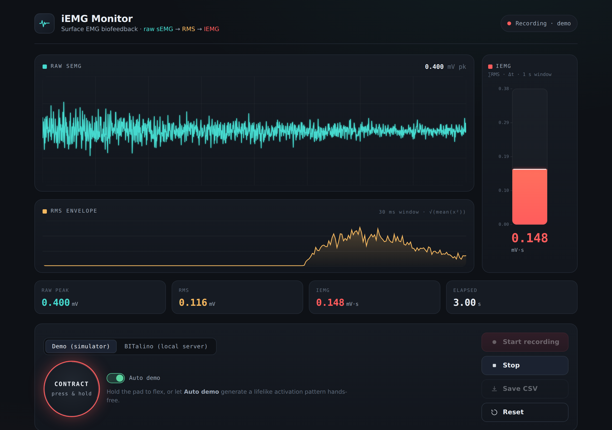
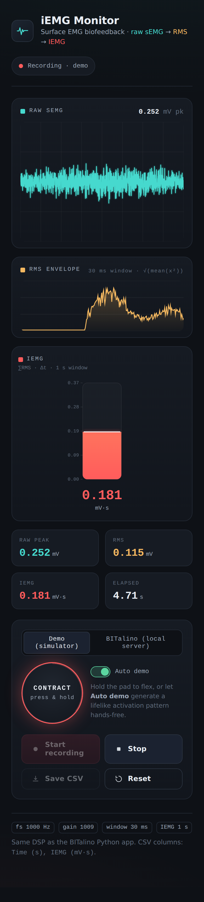

# iEMG Monitor — sEMG Biofeedback
**▶ ライブデモ: https://hata-3-git.github.io/iemg-biofeedback/**

Real-time surface EMG (sEMG) biofeedback. A muscle's electrical activity is read,
converted to millivolts, smoothed with a sliding **RMS**, and integrated into
**IEMG** — then shown as a live instrument panel in the browser.

> 筋電（sEMG）をリアルタイムに取得し、mV 変換 → **RMS** 平滑化 → **IEMG** 積分して、
> ブラウザ上の計器パネルとして表示するバイオフィードバックシステムです。

```
raw sEMG ──▶ RMS (30 ms window) ──▶ IEMG (1 s window)
  teal           amber                  coral
```



<p align="center">
  
  <br><em>Responsive down to mobile. Above: the built-in demo simulator.</em>
</p>

---

## Two ways to run / 2つの動かし方

| Mode | Signal | Needs hardware? | Where it runs |
|------|--------|-----------------|----------------|
| **Demo** | Built-in JS simulator | No | Any browser / GitHub Pages |
| **BITalino** | Real device via local Python server | Yes | Your PC (localhost) |

**EN** — The browser cannot connect to BITalino directly: Web Bluetooth only
supports BLE, while BITalino communicates over **Bluetooth Classic (SPP)**, and
in-browser Python (Pyodide) cannot open OS Bluetooth sockets. So the hardware
side stays in Python — where the `bitalino` library already works — and streams
to the front-end over a WebSocket.

**JP** — ブラウザは BITalino に直接つなげません。Web Bluetooth は BLE 専用で、
BITalino は **Bluetooth Classic（SPP）** だからです。さらにブラウザ内 Python
（Pyodide）は OS の Bluetooth ソケットを開けません。そこでハードウェア側は
Python（`bitalino` ライブラリが動く環境）に残し、WebSocket でフロントへ配信します。

```
 BITalino ──Bluetooth Classic(SPP)──▶ [PC]  Python: bitalino + FastAPI
                                        │   WebSocket /ws  (JSON frames ~33 Hz)
                                        ▼
                                 Browser: web/index.html
                          ┌ live device → ws://localhost:8000/ws  → "BITalino live"
                          └ no device   → built-in JS simulator    → "Demo signal"
```

---

## Quick start / クイックスタート

### Demo only (no install)
Open `index.html` in a browser, or host the repository on GitHub Pages.
Choose **Demo (simulator)** → **Connect** is implicit → **Start recording**.
Hold the **CONTRACT** pad to flex, or flip **Auto demo** for a hands-free pattern.

### With a real BITalino
```bash
cd server
pip install -r requirements.txt
uvicorn app:app --port 8000           # serves the UI too
```
Open <http://localhost:8000>, choose **BITalino (local server)**, enter the
device **MAC address**, then **Connect → Start recording**.

> Pair the BITalino with your computer over Bluetooth first (pairing code is
> usually `1234`). On Windows/macOS/Linux a serial port name
> (`COM3`, `/dev/tty.bitalino-DevB`, `/dev/ttyUSB0`) also works in the MAC field.

### Test the server without hardware
```bash
cd server
SIM=1 uvicorn app:app --port 8000
```
This streams a synthetic sEMG signal through the exact same DSP — useful for
checking the pipeline and UI end-to-end.

---

## Signal processing / 信号処理

Identical to the original Tkinter application. All constants are shared between
`server/app.py` and `web/index.html`.

| Parameter | Value |
|-----------|-------|
| Sampling rate | 1000 Hz |
| Window | 30 samples (30 ms) |
| ADC resolution | 10 bit |
| VCC | 3.3 V |
| Sensor gain | 1009 |
| IEMG window | 1.0 s (33 RMS points) |

```
mV   = ((raw / 2^10) − 0.5) · VCC / GAIN · 1000
RMS  = sqrt(mean(mV²))                       # per 30 ms window
IEMG = Σ RMS · Δt                            # over the last 1 s
```

CSV export columns: `Time (s), IEMG (mV·s)` — the same format as the original app.

---

## Project layout / 構成

```
iemg-biofeedback/
├── index.html              # self-contained UI (HTML + CSS + JS, no build step)
├── docs/                   # screenshots used in this README
├── server/
│   ├── app.py              # FastAPI + WebSocket; BITalino bridge + SIM mode
│   └── requirements.txt
└── README.md
```

---

## Deploy the demo on GitHub Pages / デモを GitHub Pages に公開

GitHub Pages serves static files only (no Python), so it hosts the **Demo**
build. In repository **Settings → Pages**, set the source to your branch
(`main`) and the **root** folder. The live demo appears at
`https://<username>.github.io/<repo>/`. Real-hardware use runs locally with the
server, as above.

---

## Notes / 補足

- `bitalino` depends on **pybluez** for Bluetooth Classic. If `pip install
  bitalino` fails to build pybluez, try a maintained fork such as `pybluez2`
  (see the commented line in `requirements.txt`).
- The web gauge auto-scales to the recent IEMG maximum, so the bar stays
  responsive instead of sitting near the bottom of a fixed axis.
- Alternative architectures that also work: package the Python backend + this UI
  as a desktop app with **pywebview** / **Tauri**, or use BITalino's built-in
  TCP server mode (`ip:port`) as the transport.
